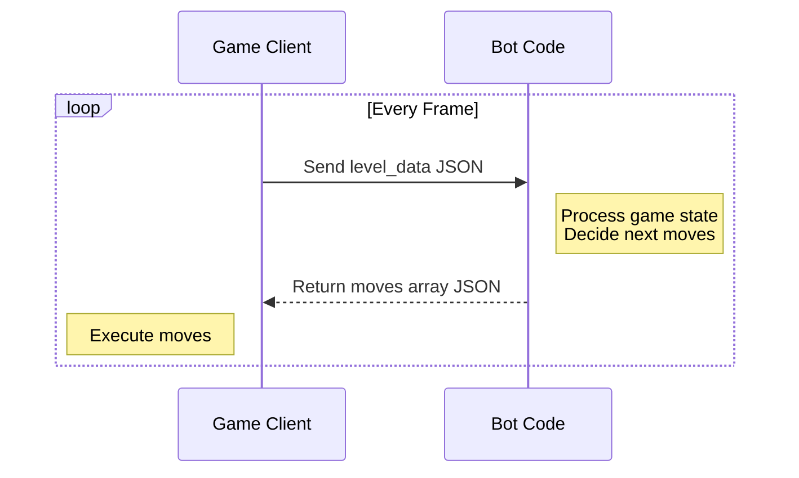

# How to Play

## Architecture

Botomy uses a client-server architecture where:



1. The game client sends level data to your bot server via HTTP POST requests
2. Your server processes the data and returns a list of moves
3. The game executes those moves for your character

Each frame, the game sends updated level data and expects new moves in response.

:::warning Real-Time Gameplay
The game runs in real-time:

- Your server must respond quickly to keep up
- The game will not pause while waiting for your response
- If your server is too slow, you may miss opportunities to act
  :::

## Basic Movement

Move your character by returning coordinates to move towards:

```json
{
  "move_to": {
    "x": 100,
    "y": 200
  }
}
```

:::tip
The coordinate system starts at (0,0) in the top-left corner
:::

## Combat

Return these actions to engage in combat:

```json
[
  "attack",     // Basic attack
  "shield",     // Block incoming damage
  "dash",       // Quick movement burst
  "special"      // Use equipped special attack
]
```

Multiple actions can be combined in a single frame:

```json
[{ "move_to": { "x": 100, "y": 200 } }, "attack", "shield"]
```

## Using Items

Activate items in your inventory:

```json
{"use": "big_potion"}    // Heal to full health
{"use": "speed_zapper"}  // Slow nearby enemies
{"use": "ring"}         // Become invisible
```

## Skill Points

When you level up, redeem skill points to improve your character:

```json
{"redeem_skill_point": "health"}   // More HP
{"redeem_skill_point": "speed"}    // Move faster
{"redeem_skill_point": "attack"}   // Deal more damage
```

## Debugging

Add debug information to help track your bot's decision making:

```json
{
  "debug_info": {
    "target_id": "enemy_1",
    "message": "Pursuing nearest enemy"
  }
}
```

Debug info appears above your character in-game.

## Character Messages

Make your character speak:

```json
{ "speak": "Hello world!" }
```

Messages appear as speech bubbles above your character.

:::tip
Combine multiple actions in a single frame to create complex behaviors:

```json
[
  { "move_to": { "x": 100, "y": 200 } },
  "attack",
  { "speak": "Take that!" },
  { "debug_info": { "message": "Attacking enemy" } }
]
```

:::
