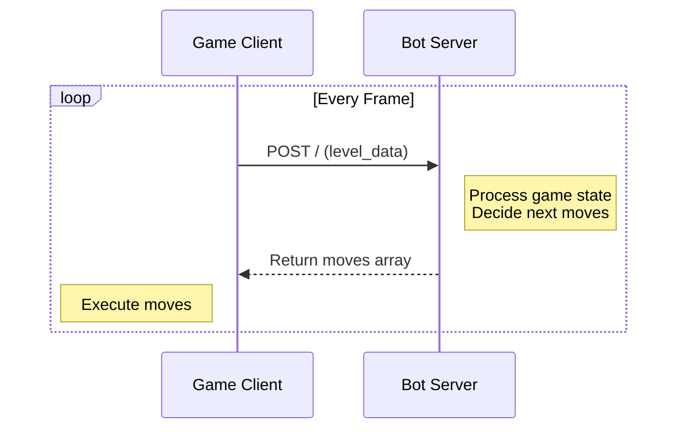

# Quickstart Tutorial

## How It Works

Botomy uses a client-server architecture:



1. The game (client) sends level data to your bot server via POST requests
2. Your server processes the data and returns a list of moves
3. The game executes those moves for your character

## Getting Started

1. Download a starter project:

   - [TypeScript Starter](https://github.com/botomy/botomy-node-starter)
   - [Python Starter](https://github.com/botomy/botomy-python-starter)

2. Start your server (follow the repo's README instructions). It should be running on port 3000.

3. In Botomy:

   - Press **RUN**
   - You should see your character say "Hello Botomy!"

   

## Making Your First Bot

Let's start with a simple task - collecting a coin!

### Basic Movement

The first thing you need to do is collect a coin. Let's modify the code to:

1. Find a coin
2. Move to the coin

```typescript
// TypeScript example modifying src/play.ts
function play(levelData: LevelData) {
  const moves = [];

  // Find a coin
  const coin = levelData.items.find(item => item.type === "coin");

  if (coin) {
    // Move to the coin's position
    moves.push({ move_to: { x: coin.position.x, y: coin.position.y } });
  }

  return moves;
}
```

```python
# Python example modifying play.py
def play(level_data: dict) -> list:
    moves = []

    # Find the coins
    coins = [item for item in level_data["items"] if item["type"] == "coin"]
    if coins:
        coin = coins[0]
        # Move to the coin's position
        moves.append({"move_to": {"x": coin["position"]["x"], "y": coin["position"]["y"]}})

    return moves
```

When you run this code:

1. Your bot will find the first coin in the list
2. Move towards its position
3. Collect it automatically when close enough
4. Gain XP points from the collection

API RESPONSE

```
[
  {
    "move_to": {
      "x": <x_coord>,
      "y": <y_coord>,
    }
  },
]
```

:::tip
Every object in the game has a position making it easy to move towards whatever you like.
:::

:::tip
The coordinate system is "raster coordinate system" where the origin is at the top left and the y-axis increases downwards.
:::

### Combat

Attacking enemy monsters and players is essential to levelling up. Let's modify the code to:

1. Move to an enemy
2. Attack

```typescript
// TypeScript example modifying src/play.ts
function play(levelData: LevelData) {
  const moves = [];

  // Find an enemy
  if (levelData.enemies && levelData.enemies.length > 0) {
    const enemy = levelData.enemies[0];

    // Move to the enemy's position
    moves.push({ move_to: { x: enemy.position.x, y: enemy.position.y } });

    // Attack
    moves.push("attack");
  }

  return moves;
}
```

```python
# Python example modifying play.py
def play(level_data: dict) -> list:
    moves = []

    # Find the enemies
    enemies = level_data["enemies"]
    if enemies:
        enemy = enemies[0]
        # Move to the enemy's position
        moves.append({"move_to": {"x": enemy["position"]["x"], "y": enemy["position"]["y"]}})

        # Attack
        moves.append("attack")

    return moves
```

You will see your character attacking while moving towards the enemy.

API RESPONSE

```
[
  {
    "move_to": {
      "x": <x_coord>,
      "y": <y_coord>,
    }
  },
  "attack"
]
```

:::tip
Try other combat mechanics like "shield", and "dash". See more here [How to Play](/docs/gameplay/how-to-play)
:::

:::tip
Your API is called multiple times per frame. This means your bot can make multiple moves per frame. The game will execute them in real time.
:::

### Debugging

## Next Steps

- Review [How to Play](/docs/gameplay/how-to-play) for all available moves
- Join our [Discord](https://discord.gg/TTdkaA63zX) for help and to share your bots!
