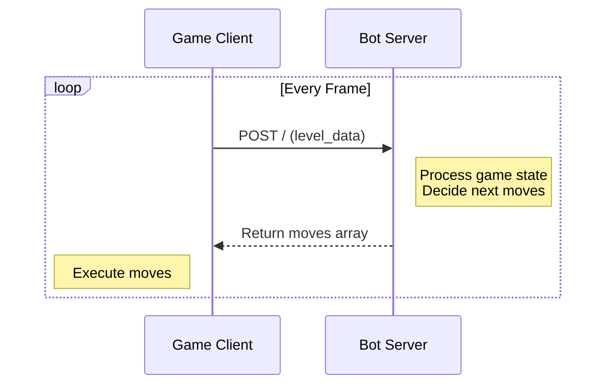
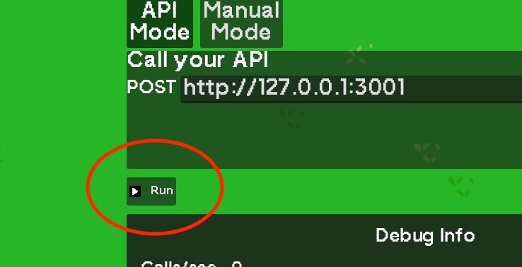

# Quickstart Tutorial

## How It Works

Botomy uses a client-server architecture:



1. The game (client) sends level data to your bot server via POST requests
2. Your server processes the data and returns a list of moves
3. The game executes those moves for your character

## Getting Started

1. Download a starter project:

   - [TypeScript Starter](https://github.com/botomy/botomy-node-starter)
   - [Python Starter](https://github.com/botomy/botomy-python-starter)

2. Start your server (follow the repo's README instructions). It should be running on port 3000.

3. In Botomy:

   - Press **RUN**
   - You should see your character say "Hello Botomy!"

   

## Making Your First Bot

Let's modify the default code to make your character move and attack:

### Basic Movement

In your server, return a position for your player to move towards:

API RESPONSE

```
[
  {
    "move_to": {
      "x": <x_coord>,
      "y": <y_coord>,
    }
  }
]
```

```typescript
// TypeScript example modifying src/play.ts
function play(levelData: LevelData) {
  const moves = [];

  // Move to coordinate (100, 100)
  moves.push({ move_to: { x: 100, y: 100 } });

  return moves;
}
```

```python
# Python example modifying play.py
def play(level_data: dict) -> list:
    moves = []

    # Move to coordinate (100, 100)
    moves.append({"move_to": {"x": 100, "y": 100}})

    return moves
```

You will see your character moving to the top left.

:::tip
Every object in the game has a position making it easy to move towards whatever you like.
:::

:::tip
The coordinate system is "raster coordinate system" where the origin is at the top left and the y-axis increases downwards.
:::

### Combat

Return the attack move

API RESPONSE

```
[
  {
    "move_to": {
      "x": <x_coord>,
      "y": <y_coord>,
    }
  },
  "attack"
]
```

```typescript
// TypeScript example modifying src/play.ts
function play(levelData: LevelData) {
  const moves = [];

  // Move to coordinate (100, 100)
  moves.push({ move_to: { x: 100, y: 100 } });

  // Attack
  moves.push("attack");

  return moves;
}
```

```python
# Python example modifying play.py
def play(level_data: dict) -> list:
    moves = []

    # Move to coordinate (100, 100)
    moves.append({"move_to": {"x": 100, "y": 100}})

    # Attack
    moves.append("attack")

    return moves
```

You will see your character attacking while moving.

:::tip
Try other combat mechanics like "shield", and "dash". See more here [How to Play](/docs/gameplay/how-to-play)
:::

:::tip
Your API is called multiple times per frame. This means your bot can make multiple moves per frame. The game will execute them in real time.
:::

### Debugging

## Next Steps

- Review [How to Play](/docs/gameplay/how-to-play) for all available moves
- Join our [Discord](https://discord.gg/TTdkaA63zX) for help and to share your bots!
