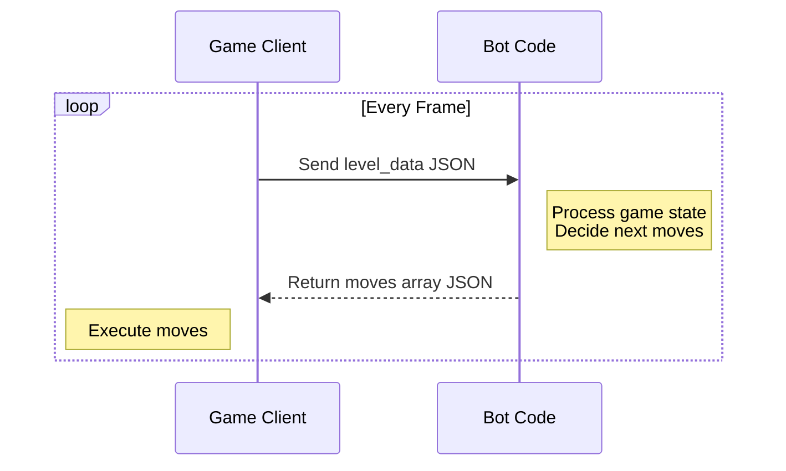

# Quickstart Tutorial

## How It Works

Botomy uses a client-server architecture where your code receives game state and returns moves to execute.



## Getting Started

### In-Game Editor (Basic)

1. Launch Botomy
2. Click "Code Editor"
3. You'll see a JavaScript editor ready to go!

### External Server (Advanced)

1. Download a starter project:
   - [TypeScript Starter](https://github.com/botomy/botomy-node-starter)
   - [Python Starter](https://github.com/botomy/botomy-python-starter)
2. Start your server on port 3000
3. In Botomy, click "API Mode"

## Making Your First Bot

Let's start with a simple task - collecting a coin!

### Basic Movement

```javascript
// JavaScript (In-Game Editor)
export default function play(levelData) {
    const moves = [];

    // Find a coin
    const coin = levelData.items.find(item => item.type === "coin");

    if (coin) {
        // Move to the coin's position
        moves.push({
            move_to: {
                x: coin.position.x,
                y: coin.position.y
            }
        });
    }

    return moves;
}
```

```typescript
// TypeScript (External Server)
// example modifying src/play.ts
function play(levelData: LevelData) {
    const moves = [];

    // Find a coin
    const coin = levelData.items.find(item => item.type === "coin");

    if (coin) {
        // Move to the coin's position
        moves.push({ move_to: { x: coin.position.x, y: coin.position.y } });
    }

    return moves;
}
```

```python
# Python (External Server)
# example modifying play.py
def play(level_data: dict) -> list:
    moves = []

    # Find the coins
    coins = [item for item in level_data["items"] if item["type"] == "coin"]
    if coins:
        coin = coins[0]
        # Move to the coin's position
        moves.append({"move_to": {"x": coin["position"]["x"], "y": coin["position"]["y"]}})

    return moves
```

When you run this code:

1. Your bot will find the first coin in the list
2. Move towards its position
3. Collect it automatically when close enough
4. Gain XP points from the collection

API RESPONSE

```
[
  {
    "move_to": {
      "x": <x_coord>,
      "y": <y_coord>,
    }
  },
]
```

:::tip
Every object in the game has a position making it easy to move towards whatever you like.
:::

:::tip
The coordinate system is "raster coordinate system" where the origin is at the top left and the y-axis increases downwards.
:::

### Combat

```javascript
// JavaScript (In-Game Editor)
function play(levelData) {
    const moves = [];

    // Find an enemy
    if (levelData.enemies && levelData.enemies.length > 0) {
        const enemy = levelData.enemies[0];

        // Move to the enemy's position
        moves.push({
            move_to: {
                x: enemy.position.x,
                y: enemy.position.y
            }
        });

        // Attack
        moves.push("attack");
    }

    return moves;
}
```

```typescript
// TypeScript (External Server)
// example modifying src/play.ts
function play(levelData: LevelData) {
    const moves = [];

    // Find an enemy
    if (levelData.enemies && levelData.enemies.length > 0) {
        const enemy = levelData.enemies[0];

        // Move to the enemy's position
        moves.push({ move_to: { x: enemy.position.x, y: enemy.position.y } });

        // Attack
        moves.push("attack");
    }

    return moves;
}
```

```python
# Python (External Server)
# example modifying play.py
def play(level_data: dict) -> list:
    moves = []

    # Find the enemies
    enemies = level_data["enemies"]
    if enemies:
        enemy = enemies[0]
        # Move to the enemy's position
        moves.append({"move_to": {"x": enemy["position"]["x"], "y": enemy["position"]["y"]}})

        # Attack
        moves.append("attack")

    return moves
```

You will see your character attacking while moving towards the enemy.

API RESPONSE

```
[
  {
    "move_to": {
      "x": <x_coord>,
      "y": <y_coord>,
    }
  },
  "attack"
]
```

:::tip

- Your code is called multiple times per frame
- You can return multiple moves per call
- The game executes moves in real-time
- Use the in-game console to help with debugging
  :::

## Next Steps

- Review [How to Play](/docs/gameplay/how-to-play) for all available moves
- Join our [Discord](https://discord.gg/TTdkaA63zX) for help and to share your bots!
