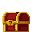

# Chest

Chests contain random power-ups when opened.



```json
{
  "id": "Chest1",        // Unique item identifier
  "type": "chest",       // Item type
  "position": {          // Current position on map
    "x": 100,
    "y": 200
  },
  "health": 100,        // Chest must be destroyed to open
  "points": 0          // XP points awarded when collected
}
```

:::tip

- Chests must be destroyed to open them
- They can contain any power-up (bomb, freeze, or shockwave)
- Other players can steal the power-up if they're faster
- Chests respawn in random locations after a long delay
  :::
