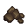
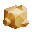

# Power Up

Power-ups grant special abilities when collected.

```json
{
  "id": "PowerUp1",      // Unique item identifier
  "type": "power_up",    // Item type
  "position": {          // Current position on map
    "x": 100,
    "y": 200
  },
  "power": "bomb",       // Type of power-up (bomb, freeze, shockwave)
  "points": 0          // XP points awarded when collected
}
```

## Power-up Types

### Bomb



- Drops explosives that create an area of effect blast with radius 128
- Deals 2.5x your attack_damage (maximum 200) to enemies and players caught in the blast
- Has a short delay before detonation
- Can act as obstacles

### Freeze


- Fires icicles in the direction you're moving
- Deals 0.33x your attack_damage (maximum 20) to enemies and players
- Freezes targets for 0.6 seconds on contact
- Frozen targets:
  - Cannot move, attack, or raise shields
  - Take 20% less damage while frozen
  - **Can** use items
- Great for crowd control (multiple enemies can be hit with the same icicle)
- Players can destroy incoming icicles by attacking them

### Shockwave



- Unleashes a circular wave of force with radius 225
- Deals 0.2x your attack_damage (maximum 15) to enemies and players
- Pushes back all enemies and players
- Can push bombs away
- Can block incoming icicles
- Useful for creating space or defensive plays

:::tip

- Only one power-up can be equipped at a time
- Collecting a new power-up replaces your current one
- Use the `special` command to activate
- All power-ups have a 1.5 second cooldown between uses
  :::
